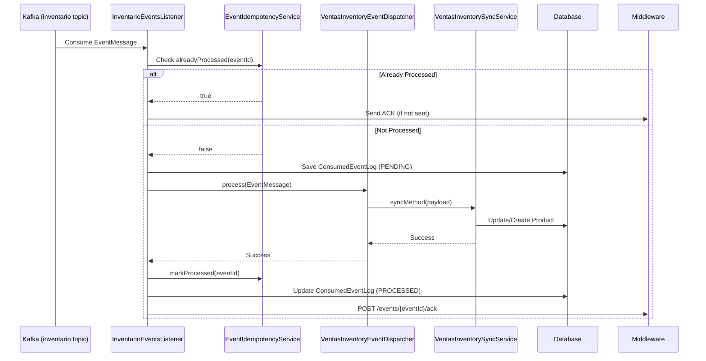

## Overview

The Ventas (Sales) microservice consumes events from the `inventario` Kafka topic to maintain a synchronized local product catalog. This enables the sales service to operate independently while staying up-to-date with inventory changes.

<Note>
Inventory event consumption is **enabled by default** in the Ventas service, while Ventas event consumption is disabled to prevent self-consumption loops.
</Note>

## Architecture

The inventory event processing flow involves several key components:



## Consumer Configuration

### Kafka Listener Setup

```java InventarioEventsListener.java:45-55
@KafkaListener(
    topics = "${inventario.kafka.topic:inventario}",
    concurrency = "${inventario.kafka.concurrency:1}",
    groupId = "${inventario.kafka.group-id:inventario-ms}"
)
public void onMessage(
    @Payload EventMessage msg,
    @Header(name = KafkaHeaders.RECEIVED_TOPIC, required = false) String topic,
    @Header(name = KafkaHeaders.RECEIVED_PARTITION, required = false) Integer partition,
    @Header(name = KafkaHeaders.OFFSET, required = false) Long offset
)
```

### Application Properties

```properties application.properties:118-125
# Kafka - Inventario Consumer Configuration
inventario.kafka.topic=inventario
inventario.kafka.concurrency=1
inventario.kafka.listen-inventario=true

# Consumer group
spring.kafka.consumer.group-id=ventas-ms

# Allow startup even if topic doesn't exist
spring.kafka.listener.missing-topics-fatal=false
```

<Warning>
Setting `spring.kafka.listener.missing-topics-fatal=false` allows the service to start even if the `inventario` topic doesn't exist yet. This is useful for development but should be reviewed for production.
</Warning>

## Event Message Structure

Inventory events follow the `EventMessage` schema:

```java EventMessage.java
public class EventMessage {
    private String eventId;          // Unique event identifier
    private String eventType;        // Human-readable event type
    private Object payload;          // Event-specific data
    private String originModule;     // Source service (e.g., "inventario-app")
    private Object timestamp;        // ISO-8601 or epoch timestamp
}
```

### Normalized Event Types

The system normalizes event types for case-insensitive matching:

```java EventMessage.java:88-96
public String getNormalizedEventType() {
    if (eventType == null) return null;
    String lower = eventType.toLowerCase();
    String normalized = Normalizer.normalize(lower, Normalizer.Form.NFD)
            .replaceAll("\\p{InCombiningDiacriticalMarks}+", "");
    return normalized.trim().replaceAll("\\s+", " ");
}
```

This handles variations like:
- `"POST: Producto Creado"` → `"post: producto creado"`
- `"PATCH: Modificar un Producto"` → `"patch: modificar un producto"`

## Supported Event Types

The dispatcher handles the following inventory events:

<Tabs>
  <Tab title="Product Events">
    ### Product Management
    
    | Event Type | Normalized | Handler Method |
    |-----------|------------|----------------|
    | `PUT: Actualizar stock` | `put: actualizar stock` | `actualizarStock()` |
    | `POST: Agregar un producto` | `post: agregar un producto` | `crearProducto()` |
    | `POST: Producto creado` | `post: producto creado` | `crearProducto()` |
    | `PATCH: Modificar un producto` | `patch: modificar un producto` | `modificarProducto()` |
    | `PATCH: Producto desactivado` | `patch: producto desactivado` | `desactivarProducto()` |
    | `PATCH: Producto activado` | `patch: producto activado` | `activarProducto()` |
    | `PATCH: Activar producto` | `patch: activar producto` | `activarProducto()` |
    | `PUT: Producto actualizado` | `put: producto actualizado` | `upsertProducto()` |
    
    ### Batch Operations
    
    | Event Type | Handler |
    |-----------|----------|
    | `POST: Agregar productos (batch)` | `crearProductosBatch()` |
    | `POST: Agregar productos batch` | `crearProductosBatch()` |
  </Tab>
  
  <Tab title="Catalog Events">
    ### Brand Management
    
    | Event Type | Normalized | Handler Method |
    |-----------|------------|----------------|
    | `POST: Marca creada` | `post: marca creada` | `crearMarca()` |
    | `PATCH: Marca activada` | `patch: marca activada` | `activarMarca()` |
    | `PATCH: Marca desactivada` | `patch: marca desactivada` | `desactivarMarca()` |
    
    ### Category Management
    
    | Event Type | Normalized | Handler Method |
    |-----------|------------|----------------|
    | `POST: Categoria creada` | `post: categoria creada` | `crearCategoria()` |
    | `PATCH: Categoria activada` | `patch: categoria activada` | `activarCategoria()` |
    | `PATCH: Categoria desactivada` | `patch: categoria desactivada` | `desactivarCategoria()` |
  </Tab>
</Tabs>

## Event Dispatcher

The `VentasInventoryEventDispatcher` routes events to appropriate handlers:

```java VentasInventoryEventDispatcher.java:17-45
public void process(EventMessage msg) {
    String normalizedType = msg.getNormalizedEventType();
    if (normalizedType == null) {
        log.warn("[Inventario->Ventas] eventType nulo, se ignora: {}", msg);
        return;
    }
    
    switch (normalizedType) {
        case "put: actualizar stock" -> syncService.actualizarStock(msg.getPayload());
        case "post: agregar un producto" -> syncService.crearProducto(msg.getPayload());
        case "post: producto creado" -> syncService.crearProducto(msg.getPayload());
        case "patch: modificar un producto" -> syncService.modificarProducto(msg.getPayload());
        case "patch: producto desactivado" -> syncService.desactivarProducto(msg.getPayload());
        case "patch: producto activado" -> syncService.activarProducto(msg.getPayload());
        case "patch: activar producto" -> syncService.activarProducto(msg.getPayload());
        case "put: producto actualizado" -> syncService.upsertProducto(msg.getPayload());
        case "post: marca creada" -> syncService.crearMarca(msg.getPayload());
        case "patch: marca activada" -> syncService.activarMarca(msg.getPayload());
        case "patch: marca desactivada" -> syncService.desactivarMarca(msg.getPayload());
        case "post: categoria creada" -> syncService.crearCategoria(msg.getPayload());
        case "patch: categoria activada" -> syncService.activarCategoria(msg.getPayload());
        case "patch: categoria desactivada" -> syncService.desactivarCategoria(msg.getPayload());
        case "post: agregar productos (batch)" -> syncService.crearProductosBatch(msg.getPayload());
        case "post: agregar productos batch" -> syncService.crearProductosBatch(msg.getPayload());
        default -> log.info("[Inventario->Ventas] Evento no reconocido, ignorado: {}", msg.getEventType());
    }
}
```

## Event Processing Flow

The main processing logic in `InventarioEventsListener`:

```java InventarioEventsListener.java:50-138
public void onMessage(@Payload EventMessage msg, ...) {
    if (msg == null) {
        log.warn("Mensaje nulo recibido. Ignorado.");
        return;
    }
    
    String eventId = msg.getEventId();
    String eventType = msg.getEventType();
    
    // 1. Create or update ConsumedEventLog
    ConsumedEventLog logRow = eventLogRepo.findByEventId(eventId)
        .orElseGet(ConsumedEventLog::new);
    logRow.setEventId(eventId);
    logRow.setEventType(eventType);
    logRow.setOriginModule(msg.getOriginModule());
    logRow.setTopic(topic);
    logRow.setPartitionId(partition);
    logRow.setOffsetValue(offset);
    logRow.setPayloadJson(mapper.writeValueAsString(msg.getPayload()));
    if (logRow.getStatus() == null || logRow.getStatus() == ConsumedEventStatus.ERROR) {
        logRow.setStatus(ConsumedEventStatus.PENDING);
    }
    logRow = eventLogRepo.save(logRow);
    
    // 2. Check idempotency
    if (idempotencyService.alreadyProcessed(eventId) || 
        logRow.getStatus() == ConsumedEventStatus.PROCESSED) {
        log.info("Evento ya procesado: {}", eventId);
        // Send ACK if not already sent
        if (Boolean.FALSE.equals(logRow.getAckSent())) {
            boolean ackOk = ackClient.sendAck(eventId, "ventas");
            logRow.setAckSent(ackOk);
            eventLogRepo.save(logRow);
        }
        monitor.recordDuplicate(eventId);
        return;
    }
    
    // 3. Process event
    try {
        dispatcher.process(msg);
        idempotencyService.markProcessed(eventId);
        logRow.setStatus(ConsumedEventStatus.PROCESSED);
        logRow.setAttempts(logRow.getAttempts() + 1);
        logRow.setLastError(null);
        
        // 4. Send ACK to middleware
        boolean ackOk = ackClient.sendAck(eventId, "ventas");
        logRow.setAckSent(ackOk);
        logRow.setAckAttempts(logRow.getAckAttempts() + 1);
        
        eventLogRepo.save(logRow);
        monitor.recordProcessed(eventType, eventId);
        log.info("Procesado OK: {} ackSent={}", eventId, ackOk);
    } catch (Exception ex) {
        monitor.recordError(eventType, eventId);
        log.error("Error procesando: {} - {}", eventId, ex.getMessage(), ex);
        logRow.setStatus(ConsumedEventStatus.ERROR);
        logRow.setAttempts(logRow.getAttempts() + 1);
        logRow.setLastError(ex.toString());
        eventLogRepo.save(logRow);
        throw ex;  // Allow Kafka retry
    }
}
```

### Key Features

1. **Idempotency**: Prevents duplicate processing using in-memory cache and database check
2. **Event Logging**: All events tracked in `ConsumedEventLog` table
3. **ACK Mechanism**: Acknowledges successful processing to middleware
4. **Error Handling**: Logs errors and allows Kafka retry mechanism
5. **Monitoring**: Records metrics via `VentasConsumerMonitorService`

## Consumed Event Log

The `ConsumedEventLog` entity tracks all consumed events:

```java ConsumedEventLog.java
@Entity
public class ConsumedEventLog {
    @Id @GeneratedValue
    private Long id;
    
    private String eventId;              // Unique event ID
    private String eventType;            // Event type
    private String originModule;         // Source service
    private String timestampRaw;         // Original timestamp
    private String topic;                // Kafka topic
    private Integer partitionId;         // Kafka partition
    private Long offsetValue;            // Kafka offset
    
    @Lob
    private String payloadJson;          // Event payload
    
    @Enumerated(EnumType.STRING)
    private ConsumedEventStatus status;  // PENDING, PROCESSED, ERROR
    
    private Integer attempts = 0;        // Processing attempts
    private String lastError;            // Last error message
    
    private Boolean ackSent = false;     // ACK sent to middleware
    private Integer ackAttempts = 0;     // ACK attempts
    private String ackLastError;         // Last ACK error
    private OffsetDateTime ackLastAt;    // Last ACK timestamp
    
    private OffsetDateTime createdAt;    // First received
    private OffsetDateTime updatedAt;    // Last updated
}
```

### Status Values

```java ConsumedEventStatus.java
public enum ConsumedEventStatus {
    PENDING,    // Received but not processed
    PROCESSED,  // Successfully processed
    ERROR       // Processing failed
}
```

## Error Handling and Retry

### Consumer-Level Retry

When processing fails, the exception is re-thrown to trigger Kafka's retry mechanism:

```java InventarioEventsListener.java:127-137
catch (Exception ex) {
    monitor.recordError(eventType, eventId);
    log.error("Error procesando eventId={} - {}", eventId, ex.getMessage(), ex);
    logRow.setStatus(ConsumedEventStatus.ERROR);
    logRow.setAttempts(logRow.getAttempts() + 1);
    logRow.setLastError(ex.toString());
    eventLogRepo.save(logRow);
    throw ex;  // Allow Kafka retry/backoff
}
```

### Scheduled Retry

Failed events are automatically retried by a background scheduler:

```properties application.properties:129-135
ventas.retry.enabled=true
ventas.retry.cron=0 0 */6 * * *  # Every 6 hours
ventas.retry.maxAttempts=5
ventas.retry.cooldown.minutes=30
ventas.retry.batchSize=100
```

The retry scheduler:
1. Queries `ConsumedEventLog` for events with `status=ERROR`
2. Filters events based on cooldown period and max attempts
3. Reprocesses events through the dispatcher
4. Updates status based on result

<Note>
The retry scheduler helps recover from transient errors like database connection issues or temporary service unavailability.
</Note>

## ACK Mechanism

After successful processing, an acknowledgment is sent to the middleware:

```java
boolean ackOk = ackClient.sendAck(eventId, "ventas");
logRow.setAckSent(ackOk);
logRow.setAckAttempts(logRow.getAckAttempts() + 1);
logRow.setAckLastAt(OffsetDateTime.now());
```

### ACK Configuration

```properties application.properties:141-145
communication.intermediary.ack.enabled=true
communication.intermediary.ack.path=/events/{eventId}/ack
communication.intermediary.ack.method=POST
```

### ACK Request

```http
POST {KAFKA_MIDDLEWARE_URL}/events/{eventId}/ack
Authorization: Bearer {backend_token}
Content-Type: application/json

{
  "consumerService": "ventas",
  "processedAt": "2024-03-15T10:30:45.123-03:00"
}
```

## Example Event Payloads

<CodeGroup>

```json POST: Producto creado
{
  "eventId": "evt_1Nx8FG2eZvKYlo2C",
  "eventType": "POST: Producto creado",
  "originModule": "inventario-app",
  "timestamp": "2024-03-15T10:30:45.123-03:00",
  "payload": {
    "productCode": "LAPTOP-HP-15",
    "name": "HP Laptop 15 inch Core i7",
    "description": "Powerful laptop for professionals",
    "price": 899.99,
    "stock": 50,
    "category": "Laptops",
    "brand": "HP",
    "active": true
  }
}
```

```json PUT: Actualizar stock
{
  "eventId": "evt_2Ox9GH3fAwLZmp3D",
  "eventType": "PUT: Actualizar stock",
  "originModule": "inventario-app",
  "timestamp": "2024-03-15T11:15:22.456-03:00",
  "payload": {
    "productCode": "LAPTOP-HP-15",
    "stock": 45,
    "previousStock": 50,
    "reason": "Purchase confirmed"
  }
}
```

```json PATCH: Producto desactivado
{
  "eventId": "evt_3Py0HI4gBxMAnq4E",
  "eventType": "PATCH: Producto desactivado",
  "originModule": "inventario-app",
  "timestamp": "2024-03-15T12:45:33.789-03:00",
  "payload": {
    "productCode": "PHONE-SAMSUNG-A54",
    "active": false,
    "reason": "Discontinued"
  }
}
```

```json POST: Agregar productos (batch)
{
  "eventId": "evt_4Qz1IJ5hCyNBor5F",
  "eventType": "POST: Agregar productos (batch)",
  "originModule": "inventario-app",
  "timestamp": "2024-03-15T13:20:10.123-03:00",
  "payload": {
    "products": [
      {
        "productCode": "MOUSE-LOGITECH-MX",
        "name": "Logitech MX Master Mouse",
        "price": 49.99,
        "stock": 100
      },
      {
        "productCode": "KEYBOARD-CORSAIR-K70",
        "name": "Corsair K70 RGB Keyboard",
        "price": 129.99,
        "stock": 75
      }
    ],
    "totalCount": 2
  }
}
```

</CodeGroup>

## Monitoring

The system includes comprehensive monitoring via `VentasConsumerMonitorService`:

```java
public class VentasConsumerMonitorService {
    void recordProcessed(String eventType, String eventId);
    void recordError(String eventType, String eventId);
    void recordDuplicate(String eventId);
    Map<String, Object> getMetrics();
}
```

### Metrics Tracked

- Total events processed
- Events by type
- Error count and rate
- Duplicate detection count
- Processing time statistics
- Last processed event timestamp

## Testing Event Consumption

<CodeGroup>

```java Unit Test
@Test
public void testProcessProductCreatedEvent() {
    EventMessage msg = new EventMessage();
    msg.setEventId("test-001");
    msg.setEventType("POST: Producto creado");
    msg.setOriginModule("inventario-app");
    msg.setTimestamp(OffsetDateTime.now().toString());
    
    Map<String, Object> payload = Map.of(
        "productCode", "TEST-001",
        "name", "Test Product",
        "price", 99.99,
        "stock", 10
    );
    msg.setPayload(payload);
    
    listener.onMessage(msg, "inventario", 0, 123L);
    
    // Verify product was created
    Product product = productRepository.findByCode("TEST-001");
    assertThat(product).isNotNull();
    assertThat(product.getName()).isEqualTo("Test Product");
    
    // Verify event was logged
    ConsumedEventLog log = eventLogRepo.findByEventId("test-001").orElseThrow();
    assertThat(log.getStatus()).isEqualTo(ConsumedEventStatus.PROCESSED);
}
```

```java Integration Test
@Test
public void testIdempotentProcessing() {
    EventMessage msg = createTestEvent("test-002");
    
    // Process first time
    listener.onMessage(msg, "inventario", 0, 124L);
    Product product1 = productRepository.findByCode("TEST-002");
    
    // Process again (duplicate)
    listener.onMessage(msg, "inventario", 0, 124L);
    Product product2 = productRepository.findByCode("TEST-002");
    
    // Should be same instance, not duplicated
    assertThat(product1.getId()).isEqualTo(product2.getId());
    
    // Verify duplicate was recorded
    verify(monitorService).recordDuplicate("test-002");
}
```

</CodeGroup>

## Troubleshooting

### Events Not Being Consumed

1. Check if listener is enabled:
   ```properties
   inventario.kafka.listen-inventario=true
   ```

2. Verify Kafka connection:
   ```bash
   kafka-topics.sh --bootstrap-server localhost:9092 --list
   ```

3. Check consumer group lag:
   ```bash
   kafka-consumer-groups.sh --bootstrap-server localhost:9092 \
     --group ventas-ms --describe
   ```

### Processing Errors

Query failed events:
```sql
SELECT * FROM consumed_event_log 
WHERE status = 'ERROR' 
ORDER BY updated_at DESC;
```

### ACK Failures

Find events with failed ACKs:
```sql
SELECT * FROM consumed_event_log 
WHERE status = 'PROCESSED' 
AND (ack_sent = false OR ack_sent IS NULL)
ORDER BY updated_at DESC;
```

## Related Topics

<CardGroup cols={2}>
  <Card title="Purchase Events" icon="cart-shopping" href="/events/purchase-events">
    Sales event emission
  </Card>
  <Card title="Product Events" icon="box" href="/events/product-events">
    Review and favorite events
  </Card>
  <Card title="Event Overview" icon="diagram-project" href="/events/overview">
    Architecture overview
  </Card>
  <Card title="Configuration" icon="gear" href="/configuration/kafka">
    Kafka setup guide
  </Card>
</CardGroup>