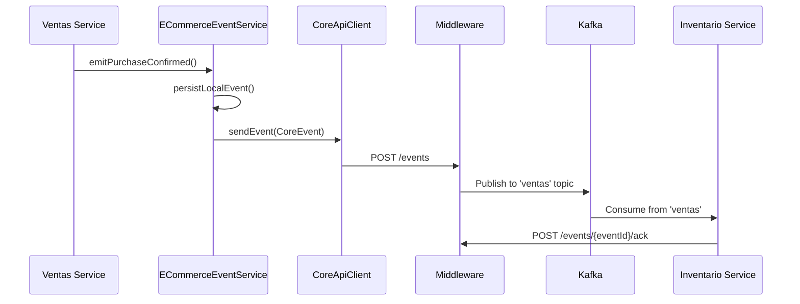

## Event-Driven Architecture

The E-commerce Backend implements a distributed event-driven architecture using **Apache Kafka** as the message broker. This design enables loose coupling between microservices, allowing them to communicate asynchronously through domain events.

<Note>
The system uses a middleware service called **Communication Core Intermediate** that acts as a centralized event hub, routing events between microservices and Kafka topics.
</Note>

## Core Components

### CoreEvent Structure

All events in the system follow a standardized structure defined by the `CoreEvent` class:

```java CoreEvent.java
public class CoreEvent {
    public String type;           // Event type identifier
    public Object payload;        // Event data (dynamic structure)
    public String timestamp;      // ISO-8601 timestamp
    public String originModule;   // Source microservice name
}
```

**Key fields:**
- **type**: Human-readable event identifier (e.g., "POST: Compra confirmada")
- **payload**: Dynamic JSON object containing event-specific data
- **timestamp**: ISO-8601 formatted timestamp using `OffsetDateTime`
- **originModule**: Identifies the originating service (defaults to Keycloak client-id)

### CoreApiClient

The `CoreApiClient` is responsible for sending events to the middleware:

```java
@Component
public class CoreApiClient {
    private final String communicationBaseUrl;
    
    public void sendEvent(CoreEvent event) {
        String url = communicationBaseUrl + "/events";
        restTemplate.postForEntity(url, event, Void.class);
    }
}
```

**Configuration:**
```properties
communication.intermediary.url=${KAFKA_MIDDLEWARE_URL:http://localhost:8090}
```

<Warning>
The client includes loop prevention logic to avoid sending events to itself during development when the middleware URL points to the same port.
</Warning>

### ECommerceEventService

The `ECommerceEventService` provides high-level methods for emitting business events:

```java
@Service
public class ECommerceEventService {
    private final CoreApiClient coreApiClient;
    private final EventRepository eventRepository;
    
    // Generic event emission
    public void emitRawEvent(String type, Object payload);
    
    // Purchase events
    public void emitPurchasePending(Integer purchaseId, Map<String, Object> user, Map<String, Object> cart);
    public void emitPurchaseConfirmed(Integer purchaseId, Map<String, Object> user, Map<String, Object> cart);
    public void emitPurchaseCancelled(Integer purchaseId, Map<String, Object> user, Map<String, Object> cart);
    
    // Review events
    public void emitReviewCreated(Integer productCode, String message, Float rateUpdated);
    
    // Favorite events
    public void emitAddFavorite(String productCode, Long id, String nombre);
    public void emitRemoveFavorite(String productCode, Long id, String nombre);
}
```

**Features:**
- Automatic backend token management via `BackendTokenManager`
- Local event persistence to `event` table before sending
- Configurable origin module name via `messaging.origin-module` property

## Kafka Topics

The system uses two primary Kafka topics:

<Tabs>
  <Tab title="ventas">
    **Topic Name:** `ventas`
    
    **Purpose:** Sales and purchase-related events
    
    **Producers:** Ventas microservice
    
    **Consumers:** Other microservices interested in purchase events
    
    **Configuration:**
    ```properties
    ventas.kafka.topic=ventas
    ventas.kafka.concurrency=3
    ventas.kafka.listen-ventas=false  # Disabled by default
    ```
    
    **Event Types:**
    - POST: Compra pendiente
    - POST: Compra confirmada
    - DELETE: Compra cancelada
    - POST: Review creada
    - POST: Producto agregado a favoritos
    - DELETE: Producto quitado de favoritos
  </Tab>
  
  <Tab title="inventario">
    **Topic Name:** `inventario`
    
    **Purpose:** Inventory and product catalog events
    
    **Producers:** Inventario microservice
    
    **Consumers:** Ventas microservice (enabled by default)
    
    **Configuration:**
    ```properties
    inventario.kafka.topic=inventario
    inventario.kafka.concurrency=1
    inventario.kafka.listen-inventario=true
    ```
    
    **Event Types:**
    - PUT: Actualizar stock
    - POST: Producto creado
    - PATCH: Modificar un producto
    - PATCH: Producto activado/desactivado
    - POST: Marca creada
    - POST: Categoria creada
  </Tab>
</Tabs>

## Event Flow Architecture

The following diagram illustrates the event flow between microservices:



**Flow Steps:**

1. **Service Method Call**: Business logic calls `ECommerceEventService` method
2. **Local Persistence**: Event is saved to local `event` table for audit
3. **Token Validation**: Backend token is validated via `BackendTokenManager`
4. **Send to Middleware**: `CoreApiClient` sends event to Communication Intermediate
5. **Kafka Publication**: Middleware publishes to appropriate Kafka topic
6. **Consumer Processing**: Subscribed services consume from topic
7. **Acknowledgment**: Consumer sends ACK back to middleware after processing

## Consumer Configuration

Kafka consumers are configured with the following settings:

```properties application.properties
# Bootstrap servers
spring.kafka.bootstrap-servers=${KAFKA_BOOTSTRAP:localhost:9092}

# Consumer group
spring.kafka.consumer.group-id=ventas-ms
spring.kafka.consumer.auto-offset-reset=earliest

# JSON deserialization
spring.kafka.consumer.value-deserializer=org.springframework.kafka.support.serializer.JsonDeserializer
spring.kafka.consumer.properties.spring.json.use.type.headers=false
spring.kafka.consumer.properties.spring.json.value.default.type=ar.edu.uade.ecommerce.ventas.EventMessage
spring.kafka.consumer.properties.spring.json.trusted.packages=*

# SASL Authentication
spring.kafka.consumer.properties.security.protocol=SASL_PLAINTEXT
spring.kafka.consumer.properties.sasl.mechanism=SCRAM-SHA-512
spring.kafka.consumer.properties.sasl.jaas.config=org.apache.kafka.common.security.scram.ScramLoginModule required username="${KAFKA_USERNAME}" password="${KAFKA_PASSWORD}";
```

<Note>
The JSON deserializer is configured to ignore type headers and deserialize all messages as `EventMessage` objects, allowing flexible payload structures.
</Note>

## Event Persistence

### Outbound Events (Published)

Events are persisted locally before sending to ensure audit trail:

```java
private void persistLocalEvent(String type, Object payload) {
    String payloadJson = objectMapper.writeValueAsString(payload);
    Event event = new Event(type, payloadJson);
    eventRepository.save(event);
}
```

**Entity Structure:**
```java
@Entity
public class Event {
    @Id @GeneratedValue
    private Integer id;
    private String type;
    @Lob
    private String payload;  // JSON string
    private LocalDateTime timestamp;
}
```

### Inbound Events (Consumed)

Consumed events are tracked in `ConsumedEventLog` for idempotency and retry logic:

```java
@Entity
public class ConsumedEventLog {
    private String eventId;
    private String eventType;
    private String originModule;
    private String timestampRaw;
    private String topic;
    private Integer partitionId;
    private Long offsetValue;
    @Lob
    private String payloadJson;
    private ConsumedEventStatus status;  // PENDING, PROCESSED, ERROR
    private Integer attempts;
    private String lastError;
    private Boolean ackSent;
    private Integer ackAttempts;
}
```

## Error Handling and Retry

The system implements comprehensive error handling:

### Consumer-Level Retry

```properties
ventas.kafka.error.maxAttempts=3
ventas.kafka.error.backoff.ms=500
```

When a consumer fails to process an event, Kafka's built-in retry mechanism attempts redelivery.

### Scheduled Retry

A background scheduler retries failed events:

```properties
ventas.retry.enabled=true
ventas.retry.cron=0 0 */6 * * *  # Every 6 hours
ventas.retry.maxAttempts=5
ventas.retry.cooldown.minutes=30
ventas.retry.batchSize=100
```

### Dead Letter Queue (Optional)

```properties
ventas.kafka.dlq.enabled=false
ventas.kafka.dlq.topicSuffix=.dlq
```

<Warning>
DLQ is currently disabled. Failed events remain in `ConsumedEventLog` with ERROR status for manual investigation.
</Warning>

## Idempotency

The `EventIdempotencyService` prevents duplicate processing:

```java
if (idempotencyService.alreadyProcessed(eventId)) {
    log.info("Event already processed: {}", eventId);
    monitor.recordDuplicate(eventId);
    return;
}

// Process event
idempotencyService.markProcessed(eventId);
```

Idempotency is achieved through:
- In-memory cache of processed event IDs
- Database check against `ConsumedEventLog.status`
- Unique constraint on `eventId` column

## Authentication

Events sent to the middleware are authenticated using OAuth2 client credentials:

```properties
keycloak.token.url=${KEYCLOAK_TOKEN_URL}
keycloak.client-id=ventas-app
keycloak.client-secret=${KEYCLOAK_CLIENT_SECRET}
```

The `BearerTokenInterceptor` automatically adds the `Authorization` header to all outgoing requests.

## Next Steps

<CardGroup cols={2}>
  <Card title="Purchase Events" icon="cart-shopping" href="/events/purchase-events">
    Learn about purchase lifecycle events
  </Card>
  <Card title="Product Events" icon="box" href="/events/product-events">
    Review and favorite events
  </Card>
  <Card title="Inventory Events" icon="warehouse" href="/events/inventory-events">
    Consuming inventory updates
  </Card>
  <Card title="API Reference" icon="code" href="/api/auth/login">
    REST API documentation
  </Card>
</CardGroup>