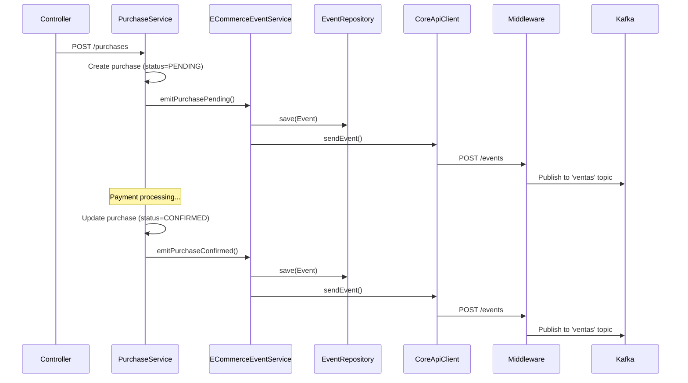

## Overview

Purchase events track the complete lifecycle of customer orders, from initial creation through confirmation or cancellation. These events are published to the `ventas` Kafka topic for consumption by other microservices.

<Note>
All purchase events are emitted through the `ECommerceEventService` and automatically persisted locally before being sent to the middleware.
</Note>

## Event Types

The system supports three purchase event states:

<CardGroup cols={3}>
  <Card title="PENDING" icon="clock" color="#FFA500">
    Initial purchase creation
  </Card>
  <Card title="CONFIRMED" icon="check" color="#22C55E">
    Payment processed successfully
  </Card>
  <Card title="CANCELLED" icon="xmark" color="#EF4444">
    Purchase cancelled by user or system
  </Card>
</CardGroup>

## Purchase Pending Event

### Description

Emitted when a new purchase order is created but not yet confirmed.

### Method Signature

```java ECommerceEventService.java:78-80
public void emitPurchasePending(
    Integer purchaseId, 
    Map<String, Object> user, 
    Map<String, Object> cart
)
```

### Event Structure

**Event Type:** `"POST: Compra pendiente"`

**Payload Schema:**

```json
{
  "purchaseId": 12345,
  "status": "PENDING",
  "user": {
    "id": 1001,
    "email": "customer@example.com",
    "name": "John Doe"
  },
  "cart": {
    "items": [
      {
        "productCode": "PROD-001",
        "quantity": 2,
        "price": 29.99
      },
      {
        "productCode": "PROD-042",
        "quantity": 1,
        "price": 149.99
      }
    ],
    "total": 209.97
  }
}
```

### Usage Example

```java
@Service
public class PurchaseService {
    private final ECommerceEventService eventService;
    
    public Purchase createPurchase(User user, Cart cart) {
        Purchase purchase = purchaseRepository.save(new Purchase(user, cart));
        
        // Emit pending event
        Map<String, Object> userMap = Map.of(
            "id", user.getId(),
            "email", user.getEmail(),
            "name", user.getName()
        );
        
        Map<String, Object> cartMap = convertCartToMap(cart);
        
        eventService.emitPurchasePending(
            purchase.getId(),
            userMap,
            cartMap
        );
        
        return purchase;
    }
}
```

<Warning>
The cart items are automatically sanitized to remove `productId` fields, keeping only `productCode`. This is handled internally by the `sanitizeCartItems` method.
</Warning>

## Purchase Confirmed Event

### Description

Emitted when payment is successfully processed and the purchase is confirmed.

### Method Signature

```java ECommerceEventService.java:82-84
public void emitPurchaseConfirmed(
    Integer purchaseId, 
    Map<String, Object> user, 
    Map<String, Object> cart
)
```

### Event Structure

**Event Type:** `"POST: Compra confirmada"`

**Payload Schema:**

```json
{
  "purchaseId": 12345,
  "status": "CONFIRMED",
  "user": {
    "id": 1001,
    "email": "customer@example.com",
    "name": "John Doe"
  },
  "cart": {
    "items": [
      {
        "productCode": "PROD-001",
        "quantity": 2,
        "price": 29.99
      }
    ],
    "total": 59.98,
    "paymentMethod": "credit_card",
    "transactionId": "txn_abc123"
  }
}
```

### Usage Example

```java
@Service
public class PaymentService {
    private final ECommerceEventService eventService;
    
    public void confirmPayment(Purchase purchase, PaymentResult result) {
        purchase.setStatus(PurchaseStatus.CONFIRMED);
        purchase.setTransactionId(result.getTransactionId());
        purchaseRepository.save(purchase);
        
        // Emit confirmed event
        eventService.emitPurchaseConfirmed(
            purchase.getId(),
            mapUser(purchase.getUser()),
            mapCart(purchase.getCart())
        );
        
        // Additional business logic (send email, update inventory, etc.)
    }
}
```

<Note>
After emitting a confirmed event, downstream services (like inventory) will typically process stock deductions automatically.
</Note>

## Purchase Cancelled Event

### Description

Emitted when a purchase is cancelled, either by the user or due to payment failure.

### Method Signature

```java ECommerceEventService.java:86-88
public void emitPurchaseCancelled(
    Integer purchaseId, 
    Map<String, Object> user, 
    Map<String, Object> cart
)
```

### Event Structure

**Event Type:** `"DELETE: Compra cancelada"`

**Payload Schema:**

```json
{
  "purchaseId": 12345,
  "status": "CANCELLED",
  "user": {
    "id": 1001,
    "email": "customer@example.com"
  },
  "cart": {
    "items": [
      {
        "productCode": "PROD-001",
        "quantity": 2
      }
    ]
  },
  "cancellationReason": "Payment failed",
  "cancelledAt": "2024-03-15T14:30:00Z"
}
```

### Usage Example

```java
@Service
public class PurchaseService {
    private final ECommerceEventService eventService;
    
    public void cancelPurchase(Integer purchaseId, String reason) {
        Purchase purchase = purchaseRepository.findById(purchaseId)
            .orElseThrow(() -> new NotFoundException("Purchase not found"));
        
        purchase.setStatus(PurchaseStatus.CANCELLED);
        purchase.setCancellationReason(reason);
        purchaseRepository.save(purchase);
        
        // Emit cancelled event
        eventService.emitPurchaseCancelled(
            purchase.getId(),
            mapUser(purchase.getUser()),
            mapCart(purchase.getCart())
        );
        
        // Refund logic if applicable
        if (purchase.isPaid()) {
            refundService.processRefund(purchase);
        }
    }
}
```

## Internal Implementation

All purchase events are handled by the internal `emitPurchaseEvent` method:

```java ECommerceEventService.java:90-112
private void emitPurchaseEvent(
    String type, 
    Integer purchaseId, 
    Map<String, Object> user, 
    Map<String, Object> cart, 
    String status
) {
    Map<String, Object> payload = new HashMap<>();
    payload.put("purchaseId", purchaseId);
    payload.put("user", user);
    
    // Sanitize cart items (removes productId, keeps productCode)
    if (cart != null) {
        sanitizeCartItems(cart);
    }
    payload.put("cart", cart);
    
    // Normalize status
    String effectiveStatus = type.equals("POST: Compra pendiente")
        ? "PENDING"
        : (status == null || status.isBlank() ? "PENDING" : status);
    
    payload.put("status", effectiveStatus);
    
    // Ensure backend token is available
    ensureBackendTokenAvailable(type);
    
    // Persist locally before sending
    persistLocalEvent(type, payload);
    
    // Create and send event
    CoreEvent event = new CoreEvent(type, payload, originModuleName);
    coreApiClient.sendEvent(event);
}
```

### Cart Sanitization

The `sanitizeCartItems` method ensures consistent cart structure:

```java ECommerceEventService.java:154-178
private void sanitizeCartItems(Map<String, Object> cart) {
    if (cart == null) return;
    
    // Support both 'items' and 'cartItems' keys
    Object itemsObj = cart.get("items");
    if (!(itemsObj instanceof List)) {
        itemsObj = cart.get("cartItems");
    }
    
    if (itemsObj instanceof List<?> rawList) {
        List<Map<String, Object>> sanitized = new ArrayList<>();
        for (Object o : rawList) {
            if (o instanceof Map<?, ?> m) {
                Map<String, Object> item = new HashMap<>();
                m.forEach((k, v) -> item.put(String.valueOf(k), v));
                
                // Remove productId (keep only productCode)
                item.remove("productId");
                sanitized.add(item);
            }
        }
        
        // Normalize to 'items' key
        cart.remove("cartItems");
        cart.put("items", sanitized);
    }
}
```

<Note>
This sanitization prevents exposing internal database IDs in events, using only business identifiers like `productCode`.
</Note>

## Complete Event Example

Here's a full `CoreEvent` as it would be sent to the middleware:

<CodeGroup>

```json POST: Compra confirmada
{
  "type": "POST: Compra confirmada",
  "timestamp": "2024-03-15T10:30:45.123-03:00",
  "originModule": "ventas-app",
  "payload": {
    "purchaseId": 12345,
    "status": "CONFIRMED",
    "user": {
      "id": 1001,
      "email": "customer@example.com",
      "name": "John Doe",
      "phone": "+54 11 1234-5678"
    },
    "cart": {
      "items": [
        {
          "productCode": "LAPTOP-HP-15",
          "quantity": 1,
          "price": 899.99,
          "name": "HP Laptop 15 inch"
        },
        {
          "productCode": "MOUSE-LOGITECH-MX",
          "quantity": 2,
          "price": 49.99,
          "name": "Logitech MX Master Mouse"
        }
      ],
      "subtotal": 999.97,
      "tax": 209.99,
      "shipping": 15.00,
      "total": 1224.96,
      "currency": "ARS",
      "paymentMethod": "credit_card",
      "transactionId": "txn_1Nx8FG2eZvKYlo2C",
      "shippingAddress": {
        "street": "Av. Corrientes 1234",
        "city": "Buenos Aires",
        "state": "CABA",
        "zipCode": "C1043",
        "country": "Argentina"
      }
    }
  }
}
```

```json POST: Compra pendiente
{
  "type": "POST: Compra pendiente",
  "timestamp": "2024-03-15T10:28:12.456-03:00",
  "originModule": "ventas-app",
  "payload": {
    "purchaseId": 12345,
    "status": "PENDING",
    "user": {
      "id": 1001,
      "email": "customer@example.com",
      "name": "John Doe"
    },
    "cart": {
      "items": [
        {
          "productCode": "LAPTOP-HP-15",
          "quantity": 1,
          "price": 899.99
        },
        {
          "productCode": "MOUSE-LOGITECH-MX",
          "quantity": 2,
          "price": 49.99
        }
      ],
      "total": 1224.96
    }
  }
}
```

```json DELETE: Compra cancelada
{
  "type": "DELETE: Compra cancelada",
  "timestamp": "2024-03-15T10:35:22.789-03:00",
  "originModule": "ventas-app",
  "payload": {
    "purchaseId": 12346,
    "status": "CANCELLED",
    "user": {
      "id": 1002,
      "email": "another@example.com"
    },
    "cart": {
      "items": [
        {
          "productCode": "PHONE-SAMSUNG-A54",
          "quantity": 1
        }
      ]
    },
    "cancellationReason": "Payment gateway timeout",
    "cancelledAt": "2024-03-15T10:35:22Z"
  }
}
```

</CodeGroup>

## Event Processing Flow



## Configuration

### Origin Module

The origin module name can be configured:

```properties
# Defaults to keycloak.client-id, then spring.application.name
messaging.origin-module=${keycloak.client-id:Ecommerce}
```

### Backend Token

Purchase events require authentication:

```properties
keycloak.token.url=${KEYCLOAK_TOKEN_URL}
keycloak.client-id=ventas-app
keycloak.client-secret=${KEYCLOAK_CLIENT_SECRET}
```

<Warning>
If the backend token is unavailable, events will still be sent but may be rejected by the middleware with a 401 status.
</Warning>

## Related Topics

<CardGroup cols={2}>
  <Card title="Product Events" icon="box" href="/events/product-events">
    Review and favorite events
  </Card>
  <Card title="Inventory Events" icon="warehouse" href="/events/inventory-events">
    Stock update consumption
  </Card>
  <Card title="Event Overview" icon="diagram-project" href="/events/overview">
    Architecture and flow
  </Card>
  <Card title="Purchase API" icon="code" href="/api/purchases/create-purchase">
    REST endpoints
  </Card>
</CardGroup>